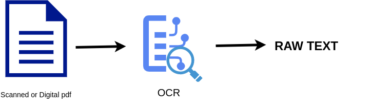

# OCR Service


This service can be used to extract textual data from the pdfs. When documents are scanned and stored as pdfs, it becomes difficult to read or search the text stored in the them. We use a mixture of pdf extraction and OCR techniques in this service that allows us to extract data from digital as well as scanned documents. In one click the user can retrieve all the text stored inside a pdf as raw text.
User will recieve a JSON response back from the service. 



In a single call to the service, the user can choose to send single or multiple pdf files to the service in a single go. 
For example, if the user chose to do OCR on two files, example1.pdf and example2.pdf, the service will return a JSON response with the following format.

## Example output:

```
{
    "example1.pdf" : 

    {
    
            0: "Text stored in page 1 of pdf 1"
            1: "Text stored in page 2 of pdf 1"
            2: "Text stored in page 3 of pdf 1"
    }

    "example2.pdf"  :

    {
            0: "Text stored in page 1 of pdf 2"
            1: "Text stored in page 2 of pdf 2"
            2: "Text stored in page 3 of pdf 2"
    }
}
```
# Supported characters for text recognition by OCR

 - Digits - [0-9]
 - English letters - [A-Z, a-z]
 - Currency - '£€¥¢฿'
 - Punctuation marks
 - Ancient Greek - 'αβγδεζηθικλμνξοπρστυφχψωΑΒΓΔΕΖΗΘΙΚΛΜΝΞΟΠΡΣΤΥΦΧΨΩ'
 - Portuguese
 - Spanish
 - German
 - French
 - Arabic
 - Czech
 - Vietnamese
 - persian_letters - 'پچڢڤگ'
 - hindi_digits - '٠١٢٣٤٥٦٧٨٩'


# Models used for OCR:

OCR involves detection and prediction. The detection model, detects where in the document text is present. Once the location of text is determined, the prediction will recognize the text. It is similar to how humans read, we will recognize each letter in the word(whether it is 'a', 'b' or any other letter) until we have read the whole word. OCR follows the similar technique. If the words are not clear and the fonts are funny, it can misread the words just like us humans.

Text Detection model used: DBNet as described in [“Real-time Scene Text Detection with Differentiable Binarization”](https://arxiv.org/pdf/1911.08947.pdf), using a ResNet-50 backbone.

Text Prediction model used: CRNN with a VGG-16 backbone as described in [“An End-to-End Trainable Neural Network for Image-based Sequence Recognition and Its Application to Scene Text Recognition”](https://arxiv.org/pdf/1507.05717.pdf).

# Usage Commands

```
echo "test ocr/extract (pass file -> get json response)"
curl -X 'POST' "${OCR_ADDRESS}/ocr/extract" -H 'accept: application/json' -H 'Content-Type: multipart/form-data' -F 'file=@/cnvrg/economics.pdf;type=application/pdf'

echo "test ocr/extract/file (pass file -> get file)"
curl -X 'POST' "${OCR_ADDRESS}/ocr/extract/file" -H 'accept: */*' -H 'Content-Type: multipart/form-data' -F 'file=@/cnvrg/economics.pdf;type=application/pdf' -o test_file.json

echo "test ocr/extract/files (pass multiple file -> get file)"
curl -X 'POST' "${OCR_ADDRESS}/ocr/extract/files" -H 'accept: */*' -H 'Content-Type: multipart/form-data' -F 'files=@/cnvrg/Data+science.pdf;type=application/pdf' -F 'files=@/cnvrg/economics.pdf;type=application/pdf' -o test_files.json
```

| Api Call           	| Function                                                      	|
|--------------------	|---------------------------------------------------------------	|
| /ocr/extract       	| base prediction endpoint handler, return results as json text 	|
| /ocr/extract/file  	| base prediction endpoint handler, return results file         	|
| /ocr/extract/files 	| base prediction endpoint handler for multifile upload         	|
| /ocr/get           	| return app status                                             	|

The Swagger based documentation can be accessed by obtaining the OCR endpoint URL, appending “/docs” to the end of the url, and pasting it in any browser tab.

As an example, the url may look like this: “https://uniquealphanumericserviceid.stg.intelcloud.cnvrg.io/docs"


The following responses can be obtained from the OCR POST calls:


| Response Code 	| Response Description 	|
|---------------	|----------------------	|
| 200           	| Successful Response  	|
| 404           	| File not found       	|
| 422           	| Validation Error     	|
| /ocr/get      	| return app status    	|

The Swagger documentation page found at your endpoint URL can also be used to try out the OCR service by uploading one or more .pdf format files from your local system and receiving a response from the endpoint.


After clicking on the “Execute” button, the endpoint will process the chosen file and generate a JSON response with the extracted text, such as in the example below:


The endpoint URL can also be accessed outside of the platform or the Swagger documentation site.


# Reference
```
@misc{doctr2021,
    title={docTR: Document Text Recognition},
    author={Mindee},
    year={2021},
    publisher = {GitHub},
    howpublished = {\url{https://github.com/mindee/doctr}}
}
```